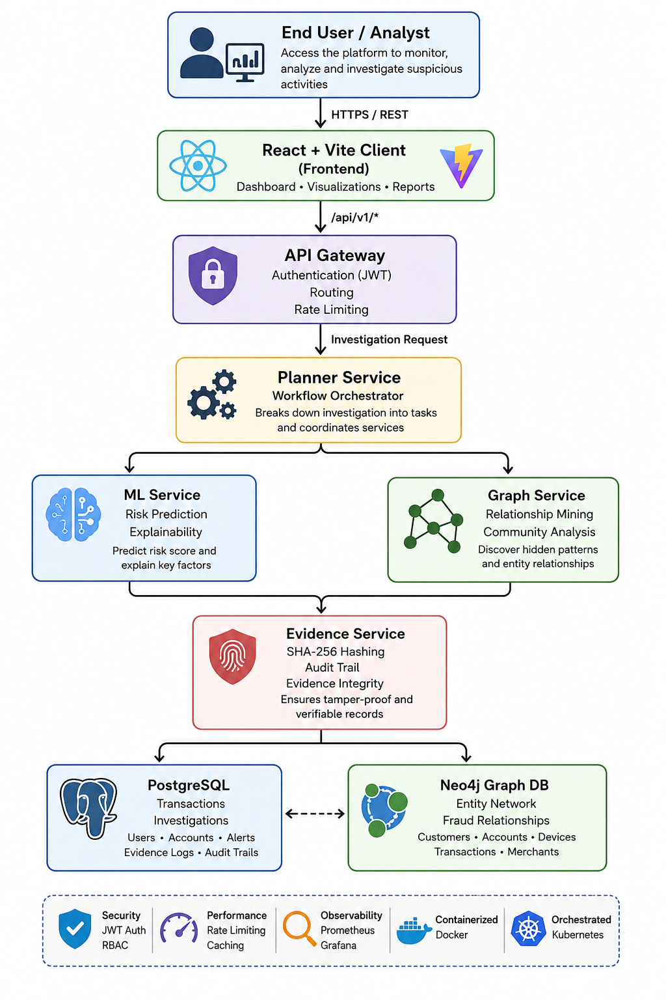
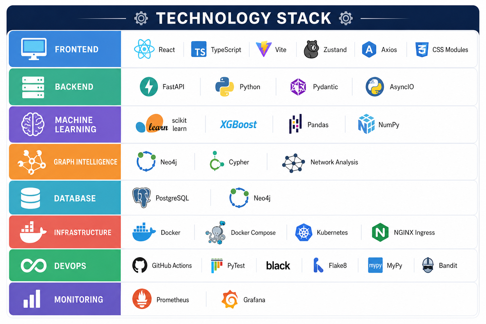
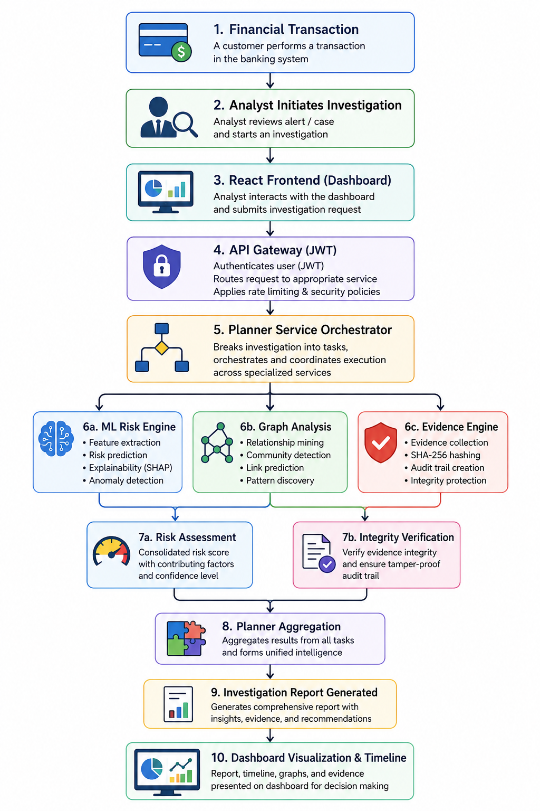
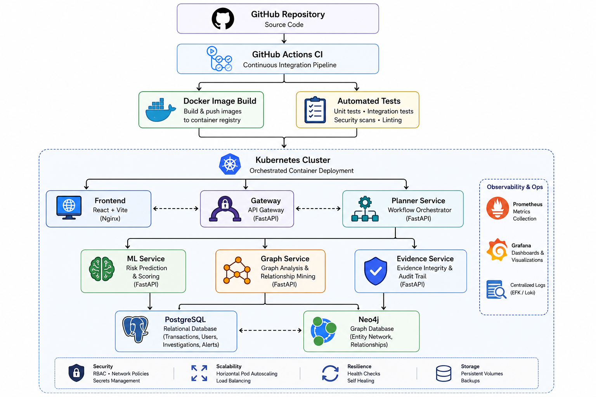

# AI-Powered Financial Fraud Investigation Platform
### Intelligent Multi-Agent AML Investigation System using AI, Graph Analytics & Explainable Risk Assessment

<div align="center">


</div>

---

## 📖 Overview

This platform is a unified intelligence orchestrator that accelerates Anti-Money Laundering (AML) investigations. By synthesizing predictive machine learning models with geospatial graph analytics and a cryptographically verifiable evidence ledger, the system autonomously transitions fragmented data into structured, explainable financial crime reports.

---

## 🏛 System Architecture



---

## 🔄 Investigation Workflow



---

## ⚙️ Technology Stack



---

## ☸️ Deployment Architecture



---

## 🛑 Problem Statement

Modern Anti-Money Laundering (AML) compliance suffers from high volumes of false positives and severe context fragmentation. Analysts are forced to manually correlate disjointed tables to uncover advanced illicit behaviors like **Structuring** (breaking large transactions into smaller, unflagged amounts), **Smurfing** (using multiple proxies), and **Layering** (complex inter-bank routing). 

Monolithic dashboards lack the compute isolation needed to scale graph algorithms alongside machine learning. Furthermore, regulatory bodies increasingly demand **Explainable AI (XAI)**, meaning opaque risk scores without an immutable, traceable audit trail are insufficient for modern compliance.

---

## 📊 Dataset Information

The project analyzes highly contextual, multi-modal financial data to uncover evasion topologies:
- **Customer Profiles**: Demographics, KYC risk levels, and account age.
- **Bank Accounts**: Balances, linked identifiers, and domicile routing.
- **Transaction History**: Sender/Receiver pairs, fiat volumes, timestamps, and velocity.
- **Merchant Information**: Categorization codes, incorporation dates, and chargeback rates.
- **Device Metadata**: IP addresses, session fingerprints, and geolocation coordinates.
- **Investigation Records**: Historical alerts and disposition codes.
- **Evidence Logs**: Immutable Merkle tree roots of case histories.

> **Note:** The project uses synthetically generated banking datasets to simulate realistic AML investigation scenarios while preserving privacy.

---

## 🔗 Data Sources Used

1. **Synthetic Customer Dataset**
2. **Synthetic Banking Transactions**
3. **Synthetic Merchant Dataset**
4. **Synthetic Device Relationship Dataset**
5. **Generated Investigation & Evidence Records**

> All datasets are synthetic and created solely for research and demonstration purposes.

---

## 💡 Solution Approach

The platform resolves investigation bottlenecks by decoupling capabilities into an orchestrated microservice mesh:

1. **React Dashboard**: The SOC analyst console for initializing investigations and viewing interactive graph topologies.
2. **API Gateway**: Provides JWT authentication, request correlation, and rate-limiting ingress.
3. **Planner Service**: An autonomous LangGraph state machine orchestrating the analytical capabilities.
4. **ML Service**: Evaluates predictive risk vectors using Scikit-Learn pipelines.
5. **Graph Service**: Traverses multi-hop entity relationships and flags cyclic laundering rings using Neo4j Cypher.
6. **Evidence Service**: Anchors the resulting intelligence summary cryptographically.
7. **PostgreSQL**: The immutable SQL ledger for the Evidence Service.
8. **Neo4j**: The high-performance geospatial database for the Graph Service.

Together, these services collaborate seamlessly to transition raw banking telemetry into a cohesive, cryptographically backed investigation report.

---

## 🤖 Agent Workflow

The Planner Service acts as an intelligent orchestration agent that coordinates specialized analytical components based on the investigation request.

1. **Accepts** an investigation request from the analyst.
2. **Determines** the required analysis workflow.
3. **Invokes** the appropriate analytical capability engines (ML, Graph).
4. **Aggregates** ML predictions, graph insights, and evidence verification.
5. **Generates** an explainable investigation report with a risk score and recommended action.

---

## 🚀 Key Features

- **AI-Powered Risk Scoring**: Real-time probability estimation of illicit behavior.
- **Graph-Based Fraud Detection**: Multi-hop community tracking and cycle detection.
- **Explainable AI (XAI)**: Transparent reasoning backing every risk score.
- **JWT Authentication**: Zero-trust stateless security model.
- **Neo4j Visualization**: Interactive 2D force-graphs embedded in the UI.
- **Evidence Integrity**: SHA-256 Merkle Tree ledger guarantees immutability.
- **Docker & Kubernetes**: Enterprise-grade containerization and orchestration.
- **CI/CD Pipelines**: Automated GitHub Actions for linting and security scanning.
- **Distributed Monitoring**: End-to-end Prometheus metrics and request tracing.

---

## 🛠 Tech Stack

- **Frontend**: React, Vite, TypeScript, Zustand, Tailwind CSS, react-force-graph-2d
- **Backend API Gateway**: FastAPI, Python-Jose (JWT), SlowAPI
- **Backend Core**: FastAPI, Uvicorn, LangGraph
- **Machine Learning**: Scikit-Learn, Pandas, NumPy
- **Graph Analytics**: Neo4j, Cypher Query Language
- **Databases**: PostgreSQL, Neo4j
- **Infrastructure**: Docker, Docker Compose
- **DevOps**: Kubernetes (Deployments, HPA, Services), GitHub Actions
- **Monitoring**: Prometheus, Grafana

---

## 📂 Project Structure

```text
frontend/
backend/
  ├── services/
  │   ├── gateway-service/
  │   ├── planner-service/
  │   ├── ml-service/
  │   ├── graph-service/
  │   └── evidence-service/
  ├── libs/
  ├── scripts/
  └── artifacts/
docker/
.github/
```

---

## ⚙️ Setup

### Prerequisites
```bash
Node 20+
Python 3.11+
Docker
Docker Compose
```

### Clone
```bash
git clone https://github.com/Sparshtaparia/AI-Powered-Financial-Fraud-Investigation-Platform.git
cd AI-Powered-Financial-Fraud-Investigation-Platform
```

### Environment
```bash
cp .env.example .env
```

### Run
```bash
docker-compose up --build -d
```

---

## 🚀 Usage

1. Open the SOC Console in your browser:
```text
http://localhost:3000
```

2. **Login (Demo Mode)**: Click "Enter Console (Demo Mode)" to seamlessly authenticate.

3. **Create Investigation**: Target an entity ID via the main dashboard.

4. **View Intelligence**:
   - **Risk Score**: Analyze the ML confidence calibration.
   - **Graph**: Interact with the topological layout.
   - **Timeline**: Track the orchestration execution.
   - **Evidence**: Verify the cryptographic ledger hash.
   - **Recommendation**: Review the autonomous analyst verdict.

---

## 📈 Future Improvements

- Implementation of streaming data ingestion pipelines.
- Kafka integration for pub/sub telemetry routing.
- SHAP (SHapley Additive exPlanations) visualizations for localized feature importance.
- LLM-assisted (Large Language Model) unstructured investigation summaries.
- Real-time active monitoring and alert generation.

---

## 👥 Contributors

**Sparsh Taparia**
- GitHub: [@Sparshtaparia](https://github.com/Sparshtaparia)
- Email: [sparshtaparia2005@gmail.com](mailto:sparshtaparia2005@gmail.com)

---

## 📜 License

This project is maintained as an academic and hackathon prototype.
